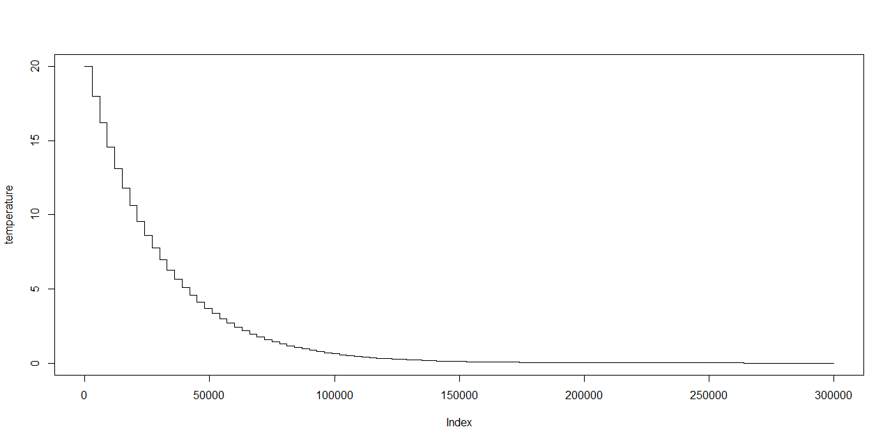
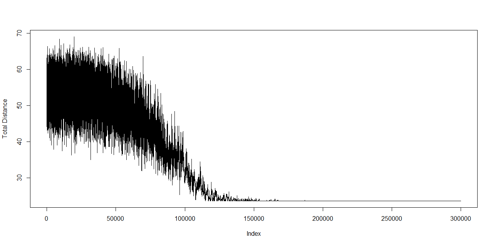
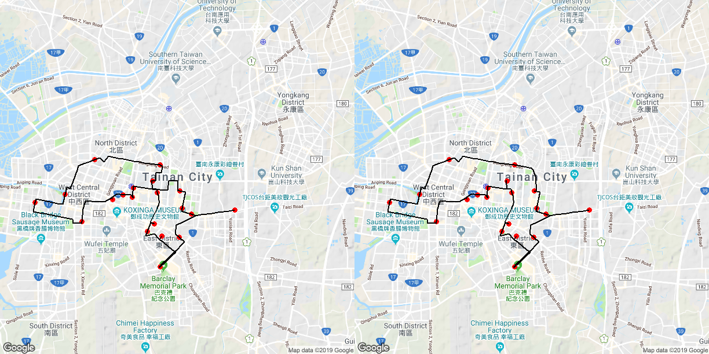

# Simulated-Annealing

  

## Description
Implement Simulated-Annealing (SA) algorithm in R to solve a real-life travelling salesman problem (TSP)

### Temperature of each state

  

### Total distance of each iteration

  

### Two final states of the convergence

  

